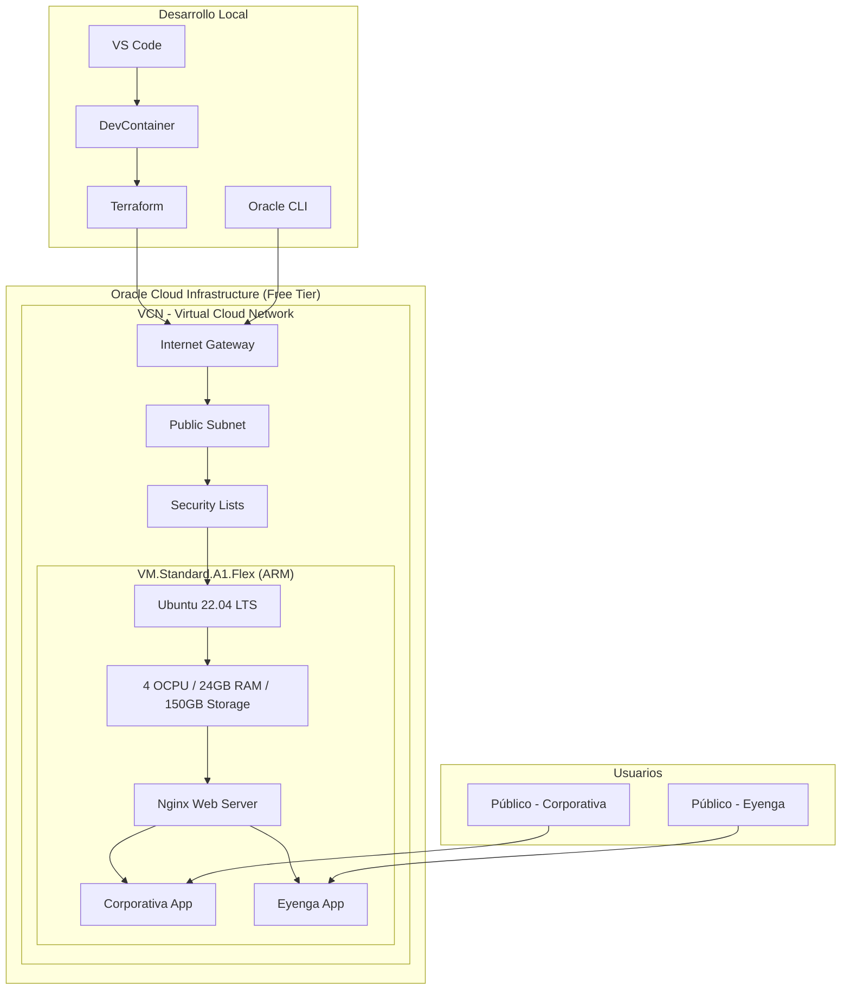
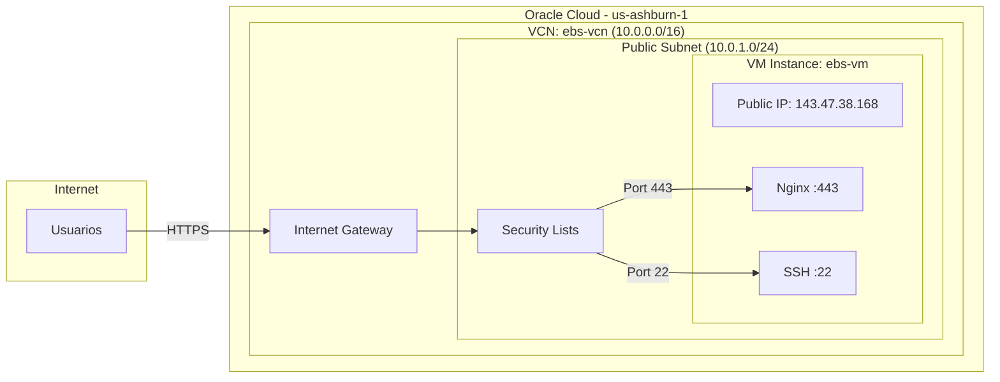

# 📚 Documentación Técnica - Executive Service Business

## 🏗️ Arquitectura del Sistema

### Visión General de la Infraestructura

Este proyecto implementa un **ecosistema completo de aplicaciones web** desplegado en **Oracle Cloud Infrastructure (Free Tier)** con las siguientes características:

- **Aplicación React Eyenga** - Sitio web educativo
- **Aplicación React Corporativa** - Portal empresarial
- **Infraestructura como Código** con Terraform
- **DevContainer** para desarrollo consistente
- **Despliegue automatizado** en Oracle Cloud Free Tier

### Diagrama de Arquitectura Cloud



### Arquitectura de Red Oracle Cloud



## 🎯 Especificaciones del Proyecto

### Información General

- **Organización**: Executive Service Business
- **Proyecto**: Portal Corporativo + Sitio Educativo Eyenga
- **Infraestructura**: Oracle Cloud Infrastructure (100% Free Tier)
- **Costo mensual**: $0.00 USD
- **Estado actual**: ✅ Infraestructura desplegada, aplicaciones listas para deployment

### Aplicaciones Implementadas

| Aplicación  | Puerto Local | URL Producción              | Estado       | Descripción         |
| ----------- | ------------ | --------------------------- | ------------ | ------------------- |
| Corporativa | 3000         | http://143.47.38.168        | 🔄 Pendiente | Portal empresarial  |
| Eyenga      | 3001         | http://143.47.38.168/eyenga | 🔄 Pendiente | Sitio web educativo |

## 🔧 Stack Tecnológico

### Infraestructura Cloud

| Componente       | Especificación         | Propósito                        |
| ---------------- | ---------------------- | -------------------------------- |
| **Oracle Cloud** | Always Free Tier       | Hosting gratuito                 |
| **VM Instance**  | VM.Standard.A1.Flex    | Servidor ARM de alto rendimiento |
| **CPU**          | 4 OCPU ARM             | Procesamiento                    |
| **RAM**          | 24 GB                  | Memoria para aplicaciones        |
| **Storage**      | 150 GB Boot Volume     | Almacenamiento SSD               |
| **Network**      | VCN + Public Subnet    | Conectividad segura              |
| **OS**           | Ubuntu 22.04 LTS ARM64 | Sistema operativo estable        |

### Stack de Desarrollo

| Tecnología     | Versión  | Propósito              | Documentación                                                                               |
| -------------- | -------- | ---------------------- | ------------------------------------------------------------------------------------------- |
| **React**      | 18.2.x   | Framework UI           | [React Docs](https://react.dev)                                                             |
| **TypeScript** | 4.9.x    | Tipado estático        | [TS Handbook](https://typescriptlang.org)                                                   |
| **Node.js**    | 20.x LTS | Runtime JS             | [Node.js Docs](https://nodejs.org/docs)                                                     |
| **Terraform**  | 1.5.x    | Infrastructure as Code | [Terraform Oracle Provider](https://registry.terraform.io/providers/oracle/oci/latest/docs) |
| **Oracle CLI** | 3.x      | Cloud Management       | [OCI CLI Docs](https://docs.oracle.com/en-us/iaas/tools/oci-cli/3.23.2/)                    |
| **Nginx**      | 1.18.x   | Web Server             | [Nginx Docs](https://nginx.org/en/docs/)                                                    |

### Herramientas DevOps

| Herramienta | Versión | Propósito                 |
| ----------- | ------- | ------------------------- |
| **Docker**  | Latest  | Contenedorización         |
| **VS Code** | Latest  | Editor + DevContainer     |
| **Git**     | Latest  | Control de versiones      |
| **SSH**     | OpenSSH | Acceso seguro al servidor |

## 🌐 Infraestructura Oracle Cloud

### Configuración de Red

```yaml
# Configuración VCN
VCN Name: ebs-vcn
CIDR Block: 10.0.0.0/16
DNS Label: ebsvcn

# Subnet Pública
Subnet Name: ebs-public-subnet
CIDR Block: 10.0.1.0/24
Route Table: Default with Internet Gateway

# Security Lists - Reglas de Firewall
Ingress Rules:
  - SSH: 0.0.0.0/0 → Port 22
  - HTTPS: 0.0.0.0/0 → Port 443
  - ICMP: 0.0.0.0/0 → All ICMP

Egress Rules:
  - All Traffic: 0.0.0.0/0 → All Ports
```

### Especificaciones de la VM

```yaml
# VM Instance Configuration
Instance Name: ebs-vm
Shape: VM.Standard.A1.Flex (ARM-based)
CPU: 4 OCPU
Memory: 24 GB RAM
Storage: 50 GB SSD
Boot Volume: 150 GB SSD
Network: 1 Gbps
OS: Ubuntu 22.04 LTS ARM64
Operating System: Ubuntu 22.04 LTS ARM64

# Network Configuration
VCN: ebs-vcn
Subnet: ebs-public-subnet (Public)
Public IP: 143.47.38.168 (Static)
Private IP: 10.0.1.x (Dynamic)

# SSH Access
SSH Key: ~/.ssh/oracle_key
Username: ubuntu
Connection: ssh -i ~/.ssh/oracle_key ubuntu@143.47.38.168
```

### Costos y Límites Free Tier

```yaml
# Oracle Cloud Always Free Resources
Compute:
  - VM.Standard.A1.Flex: 4 OCPU ARM + 24GB RAM ✅
  - Boot Volume: 200 GB total (150GB usados) ✅

Network:
  - 1 VCN ✅
  - 2 Load Balancers (no usados) ✅
  - 10 TB egress per month ✅

Storage:
  - 20 GB Block Storage (no usado) ✅
  - 10 GB Object Storage (no usado) ✅

Costo Total Mensual: $0.00 USD
```

## 📁 Estructura del Proyecto

### Organización del Workspace

```
📂 /workspace/
├── 📁 apps/                          # Aplicaciones React
│   ├── 📁 corporativa/               # Portal empresarial
│   │   ├── package.json
│   │   ├── src/
│   │   └── public/
│   └── 📁 eyenga/                    # Sitio educativo
│       ├── package.json
│       ├── src/
│       └── public/
├── 📁 terraform/                     # Infraestructura como código
│   ├── main.tf                      # Configuración principal
│   ├── variables.tf                 # Variables de entrada
│   ├── outputs.tf                   # Outputs de información
│   ├── cloud-init.yaml             # Script de inicialización
│   └── terraform.tfvars.example    # Template de variables
├── 📁 config/                       # Configuración centralizada
│   └── domains.json
├── 📁 shared/                       # Utilidades compartidas
│   └── config.ts
├── 📁 scripts/                      # Scripts de automatización
│   ├── setup-hosts.sh
│   └── remove-hosts.sh
├── package.json                     # Dependencies del workspace
├── README.md                        # Documentación principal
├── DEPLOYMENT.md                    # Guía de despliegue
├── TECHNICAL_DOCS.md               # Documentación técnica (este archivo)
└── .gitignore                      # Archivos ignorados por Git
```

### Configuración Terraform

```hcl
# terraform/main.tf - Componentes principales
resource "oci_core_vcn" "ebs_vcn" { ... }
resource "oci_core_subnet" "ebs_public_subnet" { ... }
resource "oci_core_instance" "ebs_vm" { ... }
resource "oci_core_public_ip" "ebs_public_ip" { ... }

# terraform/variables.tf - Variables configurables
variable "instance_shape" {
  description = "Shape de la instancia VM"
  type        = string
  default     = "VM.Standard.A1.Flex"

  validation {
    condition = can(regex("^VM\\.Standard\\.A1\\.Flex$", var.instance_shape))
    error_message = "Solo VM.Standard.A1.Flex está disponible en Free Tier."
  }
}
```

## 🔄 Procesos de Desarrollo

### Flujo de Trabajo Local

```bash
# 1. Desarrollo en DevContainer
cd /workspace
npm run dev:all                    # Inicia ambas apps localmente

# 2. Build para producción
npm run build:all                  # Compila ambas aplicaciones

# 3. Deploy manual a Oracle Cloud
./deploy-manual.sh                 # Script de despliegue
```

### Scripts de Automatización

```json
{
  "scripts": {
    "dev:all": "concurrently \"npm run dev:corporativa\" \"npm run dev:eyenga\"",
    "dev:corporativa": "cd apps/corporativa && npm start",
    "dev:eyenga": "cd apps/eyenga && npm start",
    "build:all": "concurrently \"npm run build:corporativa\" \"npm run build:eyenga\"",
    "build:corporativa": "cd apps/corporativa && npm run build",
    "build:eyenga": "cd apps/eyenga && npm run build",
    "deploy": "bash scripts/deploy-apps.sh",
    "terraform:init": "cd terraform && terraform init",
    "terraform:plan": "cd terraform && terraform plan",
    "terraform:apply": "cd terraform && terraform apply"
  }
}
```

## 🔐 Configuración de Seguridad

### Acceso SSH

```bash
# Generación de clave SSH para Oracle Cloud
ssh-keygen -t rsa -b 4096 -f ~/.ssh/oracle_key -C "oracle-cloud-key"

# Configuración SSH
Host oracle-vm
    HostName 143.47.38.168
    User ubuntu
    IdentityFile ~/.ssh/oracle_key
    StrictHostKeyChecking no
```

### Firewall y Security Lists

```yaml
# Oracle Cloud Security Lists
Ingress Rules:
  SSH (Port 22):
    Source: 0.0.0.0/0
    Protocol: TCP
    Description: "SSH access"

  HTTPS (Port 443):
    Source: 0.0.0.0/0
    Protocol: TCP
    Description: "HTTPS web traffic"

  ICMP:
    Source: 0.0.0.0/0
    Protocol: ICMP
    Description: "Ping responses"

# UFW Firewall en VM
sudo ufw default deny incoming
sudo ufw default allow outgoing
sudo ufw allow ssh
sudo ufw allow 'Nginx Full'
sudo ufw --force enable
```

### Configuración Nginx

```nginx
# /etc/nginx/sites-available/webapp
server {
    listen 80 default_server;
    listen [::]:80 default_server;
    server_name 143.47.38.168;

    # Redirigir a HTTPS en producción
    # return 301 https://$server_name$request_uri;

    # Servir Corporativa en raíz
    location / {
        root /var/www/corporativa;
        try_files $uri $uri/ /index.html;
    }

    # Servir Eyenga en subpath
    location /eyenga {
        alias /var/www/eyenga;
        try_files $uri $uri/ /eyenga/index.html;
    }

    # Headers de seguridad
    add_header X-Frame-Options "SAMEORIGIN" always;
    add_header X-XSS-Protection "1; mode=block" always;
    add_header X-Content-Type-Options "nosniff" always;
}
```

## 🐳 DevContainer Especificaciones

### Configuración del Contenedor

```json
{
  "name": "React + Oracle Cloud Development",
  "image": "mcr.microsoft.com/devcontainers/javascript-node:1-20-bullseye",
  "features": {
    "ghcr.io/devcontainers/features/git:1": {},
    "ghcr.io/devcontainers/features/github-cli:1": {},
    "ghcr.io/devcontainers/features/terraform:1": {}
  },
  "forwardPorts": [3000, 3001],
  "portsAttributes": {
    "3000": { "label": "Corporativa", "onAutoForward": "openBrowser" },
    "3001": { "label": "Eyenga", "onAutoForward": "openBrowser" }
  },
  "postCreateCommand": "npm install && chmod +x scripts/*.sh"
}
```

### Extensiones VS Code

```json
{
  "extensions": [
    "ms-vscode.vscode-typescript-next",
    "esbenp.prettier-vscode",
    "dbaeumer.vscode-eslint",
    "hashicorp.terraform",
    "ms-vscode.remote-containers",
    "GitHub.copilot"
  ]
}
```

## 📊 Monitoreo y Performance

### Métricas de la VM

```bash
# Recursos disponibles
CPU: 4 OCPU ARM (100% Free Tier)
RAM: 24 GB (100% Free Tier)
Storage: 150 GB SSD (75% del límite Free Tier)
Network: 10 TB/mes egress (Free Tier)

# Monitoreo básico
htop                               # Monitor de recursos
df -h                             # Uso de disco
free -h                           # Uso de memoria
sudo systemctl status nginx      # Estado del web server
```

### Logs y Diagnóstico

```bash
# Logs del sistema
sudo tail -f /var/log/syslog
sudo tail -f /var/log/cloud-init-output.log

# Logs de Nginx
sudo tail -f /var/log/nginx/access.log
sudo tail -f /var/log/nginx/error.log

# Verificación de servicios
sudo systemctl status nginx
sudo systemctl status ssh
sudo ufw status verbose
```

## 🚀 Deployment y CI/CD

### Deployment Manual

```bash
# 1. Conectar a la VM
ssh -i ~/.ssh/oracle_key ubuntu@143.47.38.168

# 2. Clonar repositorio (si no existe)
git clone <repository-url> /home/ubuntu/webapp

# 3. Actualizar código
cd /home/ubuntu/webapp
git pull origin main

# 4. Build de aplicaciones
npm install
npm run build:all

# 5. Copiar builds a Nginx
sudo cp -r apps/corporativa/build/* /var/www/corporativa/
sudo cp -r apps/eyenga/build/* /var/www/eyenga/

# 6. Reiniciar Nginx
sudo systemctl reload nginx
```

### Automatización Future

```yaml
# Posible GitHub Actions workflow
name: Deploy to Oracle Cloud
on:
  push:
    branches: [main]

jobs:
  deploy:
    runs-on: ubuntu-latest
    steps:
      - uses: actions/checkout@v3
      - name: Setup Node.js
        uses: actions/setup-node@v3
        with:
          node-version: "20"
      - name: Build apps
        run: npm run build:all
      - name: Deploy to VM
        uses: appleboy/ssh-action@v0.1.5
        with:
          host: 143.47.38.168
          username: ubuntu
          key: ${{ secrets.SSH_PRIVATE_KEY }}
          script: |
            cd /home/ubuntu/webapp
            git pull origin main
            npm run build:all
            sudo cp -r apps/*/build/* /var/www/
            sudo systemctl reload nginx
```

## 🔧 Troubleshooting

### Problemas Comunes

#### 1. Error de conexión SSH

```bash
# Verificar permisos de la clave
chmod 600 ~/.ssh/oracle_key

# Conexión con debug
ssh -i ~/.ssh/oracle_key -v ubuntu@143.47.38.168
```

#### 2. Aplicaciones no cargan

```bash
# Verificar archivos en la VM
ssh -i ~/.ssh/oracle_key ubuntu@143.47.38.168
ls -la /var/www/corporativa/
ls -la /var/www/eyenga/

# Verificar Nginx
sudo nginx -t
sudo systemctl status nginx
```

#### 3. Error en Terraform

```bash
# Verificar configuración OCI
cat ~/.oci/config

# Re-inicializar Terraform
cd terraform
terraform init -reconfigure
terraform plan
```

### Scripts de Diagnóstico

```bash
# Script de verificación completa
#!/bin/bash
echo "🔍 Diagnóstico Oracle Cloud VM"
echo "VM IP: 143.47.38.168"
echo "Terraform State: $(terraform -chdir=terraform show | grep -c "oci_core_instance")"
echo "SSH Access: $(ssh -i ~/.ssh/oracle_key -o ConnectTimeout=5 ubuntu@143.47.38.168 'echo OK' 2>/dev/null || echo 'FAILED')"
echo "HTTP Response: $(curl -s -I http://143.47.38.168 | head -1 || echo 'No response')"
```

---

**Versión**: v2.0 - Oracle Cloud Edition  
**Fecha**: 15 de Agosto, 2025  
**Infraestructura**: Oracle Cloud Infrastructure (Free Tier)  
**Costo**: $0.00 USD/mes  
**Mantenido por**: Executive Service Business Development Team

## 🌐 Configuración de Red y Dominios

### Puertos Asignados

| Puerto    | Aplicación  | URL Local             | URL Dominio                   |
| --------- | ----------- | --------------------- | ----------------------------- |
| 3000      | Corporativa | http://localhost:3000 | http://corporativa.local:3000 |
| 3001      | Eyenga      | http://localhost:3001 | http://eyenga.local:3001      |
| 3002-3010 | Reservados  | -                     | -                             |

### Configuración de Hosts Local

Los scripts modifican `/etc/hosts` para habilitar dominios locales:

```bash
# /etc/hosts entries added by setup-hosts.sh
127.0.0.1 corporativa.local
127.0.0.1 eyenga.local
```

### Configuración de DevContainer Ports

```json
{
  "forwardPorts": [3000, 3001, 8080, 8081],
  "portsAttributes": {
    "3000": {
      "label": "Corporativa App",
      "onAutoForward": "openBrowser"
    },
    "3001": {
      "label": "Eyenga App",
      "onAutoForward": "openBrowser"
    }
  }
}
```

## 📁 Gestión de Archivos y Configuración

### Estructura de Configuración

```
📂 config/
└── domains.json              # Configuración centralizada de dominios

📂 shared/
└── config.ts                 # Utilidades de configuración compartidas

📂 scripts/
├── setup-hosts.sh            # Configuración de dominios locales
└── remove-hosts.sh           # Limpieza de dominios locales
```

### Archivo domains.json

```json
{
  "corporativa": {
    "development": "corporativa.local",
    "staging": "staging.corporativa.com",
    "production": "corporativa.com"
  },
  "eyenga": {
    "development": "eyenga.local",
    "staging": "staging.eyenga.com",
    "production": "eyenga.com"
  }
}
```

### Utilidades Compartidas (shared/config.ts)

```typescript
// Interfaz para configuración de sitio
interface SiteConfig {
  development: string;
  staging?: string;
  production: string;
}

// Función para obtener configuración de Corporativa
export const getCorporativaConfig = (): SiteConfig => {
  const domains = require("../config/domains.json");
  return domains.corporativa;
};

// Función para obtener configuración de Eyenga
export const getEyengaConfig = (): SiteConfig => {
  const domains = require("../config/domains.json");
  return domains.eyenga;
};
```

## 🔄 Scripts de Automatización

### Scripts del Workspace Principal

```json
{
  "scripts": {
    "dev:all": "concurrently \"npm run dev:corporativa\" \"npm run dev:eyenga\"",
    "dev:corporativa": "cd apps/corporativa && npm start",
    "dev:eyenga": "cd apps/eyenga && npm start",
    "build:all": "concurrently \"npm run build:corporativa\" \"npm run build:eyenga\"",
    "build:corporativa": "cd apps/corporativa && npm run build",
    "build:eyenga": "cd apps/eyenga && npm run build",
    "test:all": "concurrently \"npm run test:corporativa\" \"npm run test:eyenga\"",
    "test:corporativa": "cd apps/corporativa && npm test",
    "test:eyenga": "cd apps/eyenga && npm test",
    "clean": "rm -rf node_modules apps/*/node_modules"
  }
}
```

### Script de Configuración Inicial (setup.sh)

```bash
#!/bin/bash
# Funciones principales:
# 1. Instalar dependencias del workspace
# 2. Crear aplicaciones React con TypeScript
# 3. Configurar puertos específicos
# 4. Crear archivos de configuración
```

### Scripts de Hosts

```bash
# setup-hosts.sh - Añadir dominios locales
echo "127.0.0.1 corporativa.local" >> /etc/hosts
echo "127.0.0.1 eyenga.local" >> /etc/hosts

# remove-hosts.sh - Remover dominios locales
sed -i '/corporativa.local/d' /etc/hosts
sed -i '/eyenga.local/d' /etc/hosts
```

## 🐳 DevContainer Especificaciones

### Configuración Base

```json
{
  "name": "React Multi-Site Development",
  "image": "mcr.microsoft.com/devcontainers/javascript-node:1-20-bullseye",
  "features": {
    "ghcr.io/devcontainers/features/git:1": {},
    "ghcr.io/devcontainers/features/github-cli:1": {}
  },
  "postCreateCommand": "npm install -g create-react-app yarn"
}
```

### Extensiones VS Code Incluidas

```json
{
  "extensions": [
    "ms-vscode.vscode-typescript-next",
    "bradlc.vscode-tailwindcss",
    "esbenp.prettier-vscode",
    "dbaeumer.vscode-eslint",
    "formulahendry.auto-rename-tag",
    "christian-kohler.path-intellisense",
    "GitHub.copilot",
    "ritwickdey.LiveServer"
  ]
}
```

## 🔍 Debugging y Desarrollo

### Configuración de Debug

Para cada aplicación, se puede configurar debugging en VS Code:

```json
{
  "name": "Debug Corporativa",
  "type": "node",
  "request": "launch",
  "cwd": "${workspaceFolder}/apps/corporativa",
  "runtimeExecutable": "npm",
  "runtimeArgs": ["start"]
}
```

### Hot Reloading

- **Automático**: Los cambios en archivos se reflejan inmediatamente
- **Puerto específico**: Cada app mantiene su propia instancia
- **Error boundaries**: Errores no afectan otras aplicaciones

### Logging y Monitoreo

```typescript
// Configuración de logging para desarrollo
const isDevelopment = process.env.NODE_ENV === "development";

if (isDevelopment) {
  console.log("🚀 App iniciada en modo desarrollo");
  console.log("🌐 Puerto:", process.env.PORT);
  console.log("🏠 Dominio:", process.env.REACT_APP_DOMAIN);
}
```

## 🚀 Proceso de Deployment

### Preparación para Producción

1. **Actualizar configuración de dominios**:

   ```json
   {
     "corporativa": {
       "production": "https://tusitio.com"
     }
   }
   ```

2. **Variables de entorno de producción**:

   ```env
   REACT_APP_ENVIRONMENT=production
   REACT_APP_API_URL=https://api.tusitio.com
   ```

3. **Build optimizado**:
   ```bash
   npm run build:all
   ```

### Estructura de Build

```
📂 apps/corporativa/build/
├── static/
│   ├── css/
│   ├── js/
│   └── media/
├── index.html
└── manifest.json

📂 apps/eyenga/build/
├── static/
│   ├── css/
│   ├── js/
│   └── media/
├── index.html
└── manifest.json
```

## 📊 Performance y Optimización

### Métricas Objetivo

| Métrica                      | Objetivo | Herramienta |
| ---------------------------- | -------- | ----------- |
| **First Contentful Paint**   | < 2s     | Lighthouse  |
| **Largest Contentful Paint** | < 4s     | Lighthouse  |
| **First Input Delay**        | < 100ms  | Lighthouse  |
| **Cumulative Layout Shift**  | < 0.1    | Lighthouse  |

### Estrategias de Optimización

- **Code Splitting**: Dividir código en chunks
- **Lazy Loading**: Cargar componentes bajo demanda
- **Tree Shaking**: Eliminar código no usado
- **Asset Optimization**: Compresión de imágenes y assets

## 🔒 Seguridad

### Mejores Prácticas Implementadas

- **HTTPS**: Configuración para producción
- **Content Security Policy**: Headers de seguridad
- **XSS Prevention**: Sanitización de inputs
- **Environment Variables**: Secrets no expuestos

### Checklist de Seguridad

- [ ] Variables de entorno seguras
- [ ] Dependencias actualizadas (`npm audit`)
- [ ] HTTPS en producción
- [ ] CSP headers configurados
- [ ] Input validation implementada

---

**Versión**: v1.0  
**Última actualización**: 15 de Agosto, 2025  
**Mantenido por**: Equipo de Desarrollo
