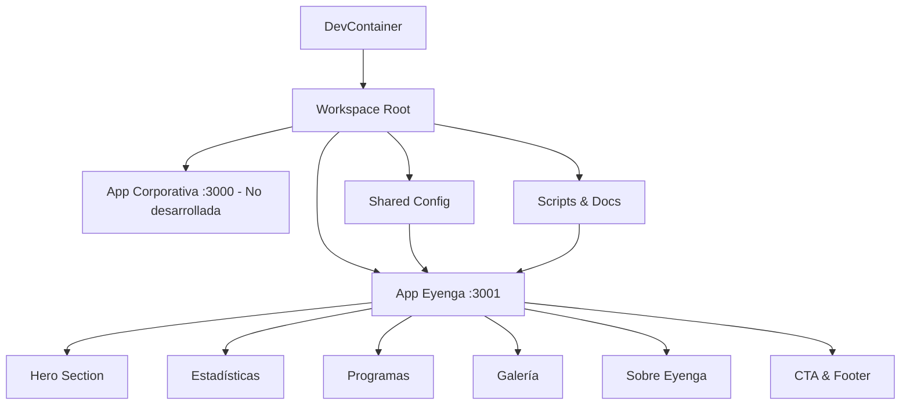

# 📚 Documentación Técnica - Proyecto Eyenga

## 🏗️ Arquitectura del Sistema

### Visión General

Este proyecto implementa el **sitio web educativo para el proyecto Eyenga** con las siguientes características:

- **Aplicación React principal** (Eyenga) completamente desarrollada
- **DevContainer** para desarrollo consistente
- **Scripts automatizados** para tareas comunes
- **Configuración modular** y escalable
- **Assets específicos** del proyecto educativo

### Diagrama de Arquitectura



## 🎯 Enfoque del Proyecto

**Objetivo Principal**: Sitio web para el proyecto educativo Eyenga

- **Estado**: ✅ Completamente desarrollado y funcional
- **Tecnología**: React 18.x + TypeScript + CSS3
- **Características**: Responsive, moderno, con contenido auténtico

## 🔧 Tecnologías y Dependencias

### Stack Tecnológico Principal

| Tecnología     | Versión  | Propósito       | Documentación                             |
| -------------- | -------- | --------------- | ----------------------------------------- |
| **React**      | 18.2.x   | Framework UI    | [React Docs](https://react.dev)           |
| **TypeScript** | 4.9.x    | Tipado estático | [TS Handbook](https://typescriptlang.org) |
| **Node.js**    | 20.x LTS | Runtime JS      | [Node.js Docs](https://nodejs.org/docs)   |
| **npm**        | 10.x     | Package Manager | [npm Docs](https://docs.npmjs.com)        |

### Herramientas de Desarrollo

| Herramienta      | Versión | Propósito             |
| ---------------- | ------- | --------------------- |
| **Docker**       | Latest  | Contenedorización     |
| **VS Code**      | Latest  | Editor + DevContainer |
| **ESLint**       | Latest  | Linting de código     |
| **Prettier**     | Latest  | Formateo de código    |
| **Concurrently** | 8.2.x   | Ejecución paralela    |

### Dependencias del Workspace

```json
{
  "devDependencies": {
    "concurrently": "^8.2.2",
    "cross-env": "^7.0.3"
  },
  "dependencies": {}
}
```

## 🌐 Configuración de Red y Dominios

### Puertos Asignados

| Puerto    | Aplicación  | URL Local             | URL Dominio                   |
| --------- | ----------- | --------------------- | ----------------------------- |
| 3000      | Corporativa | http://localhost:3000 | http://corporativa.local:3000 |
| 3001      | Eyenga      | http://localhost:3001 | http://eyenga.local:3001      |
| 3002-3010 | Reservados  | -                     | -                             |

### Configuración de Hosts Local

Los scripts modifican `/etc/hosts` para habilitar dominios locales:

```bash
# /etc/hosts entries added by setup-hosts.sh
127.0.0.1 corporativa.local
127.0.0.1 eyenga.local
```

### Configuración de DevContainer Ports

```json
{
  "forwardPorts": [3000, 3001, 8080, 8081],
  "portsAttributes": {
    "3000": {
      "label": "Corporativa App",
      "onAutoForward": "openBrowser"
    },
    "3001": {
      "label": "Eyenga App",
      "onAutoForward": "openBrowser"
    }
  }
}
```

## 📁 Gestión de Archivos y Configuración

### Estructura de Configuración

```
📂 config/
└── domains.json              # Configuración centralizada de dominios

📂 shared/
└── config.ts                 # Utilidades de configuración compartidas

📂 scripts/
├── setup-hosts.sh            # Configuración de dominios locales
└── remove-hosts.sh           # Limpieza de dominios locales
```

### Archivo domains.json

```json
{
  "corporativa": {
    "development": "corporativa.local",
    "staging": "staging.corporativa.com",
    "production": "corporativa.com"
  },
  "eyenga": {
    "development": "eyenga.local",
    "staging": "staging.eyenga.com",
    "production": "eyenga.com"
  }
}
```

### Utilidades Compartidas (shared/config.ts)

```typescript
// Interfaz para configuración de sitio
interface SiteConfig {
  development: string;
  staging?: string;
  production: string;
}

// Función para obtener configuración de Corporativa
export const getCorporativaConfig = (): SiteConfig => {
  const domains = require("../config/domains.json");
  return domains.corporativa;
};

// Función para obtener configuración de Eyenga
export const getEyengaConfig = (): SiteConfig => {
  const domains = require("../config/domains.json");
  return domains.eyenga;
};
```

## 🔄 Scripts de Automatización

### Scripts del Workspace Principal

```json
{
  "scripts": {
    "dev:all": "concurrently \"npm run dev:corporativa\" \"npm run dev:eyenga\"",
    "dev:corporativa": "cd apps/corporativa && npm start",
    "dev:eyenga": "cd apps/eyenga && npm start",
    "build:all": "concurrently \"npm run build:corporativa\" \"npm run build:eyenga\"",
    "build:corporativa": "cd apps/corporativa && npm run build",
    "build:eyenga": "cd apps/eyenga && npm run build",
    "test:all": "concurrently \"npm run test:corporativa\" \"npm run test:eyenga\"",
    "test:corporativa": "cd apps/corporativa && npm test",
    "test:eyenga": "cd apps/eyenga && npm test",
    "clean": "rm -rf node_modules apps/*/node_modules"
  }
}
```

### Script de Configuración Inicial (setup.sh)

```bash
#!/bin/bash
# Funciones principales:
# 1. Instalar dependencias del workspace
# 2. Crear aplicaciones React con TypeScript
# 3. Configurar puertos específicos
# 4. Crear archivos de configuración
```

### Scripts de Hosts

```bash
# setup-hosts.sh - Añadir dominios locales
echo "127.0.0.1 corporativa.local" >> /etc/hosts
echo "127.0.0.1 eyenga.local" >> /etc/hosts

# remove-hosts.sh - Remover dominios locales
sed -i '/corporativa.local/d' /etc/hosts
sed -i '/eyenga.local/d' /etc/hosts
```

## 🐳 DevContainer Especificaciones

### Configuración Base

```json
{
  "name": "React Multi-Site Development",
  "image": "mcr.microsoft.com/devcontainers/javascript-node:1-20-bullseye",
  "features": {
    "ghcr.io/devcontainers/features/git:1": {},
    "ghcr.io/devcontainers/features/github-cli:1": {}
  },
  "postCreateCommand": "npm install -g create-react-app yarn"
}
```

### Extensiones VS Code Incluidas

```json
{
  "extensions": [
    "ms-vscode.vscode-typescript-next",
    "bradlc.vscode-tailwindcss",
    "esbenp.prettier-vscode",
    "dbaeumer.vscode-eslint",
    "formulahendry.auto-rename-tag",
    "christian-kohler.path-intellisense",
    "GitHub.copilot",
    "ritwickdey.LiveServer"
  ]
}
```

## 🔍 Debugging y Desarrollo

### Configuración de Debug

Para cada aplicación, se puede configurar debugging en VS Code:

```json
{
  "name": "Debug Corporativa",
  "type": "node",
  "request": "launch",
  "cwd": "${workspaceFolder}/apps/corporativa",
  "runtimeExecutable": "npm",
  "runtimeArgs": ["start"]
}
```

### Hot Reloading

- **Automático**: Los cambios en archivos se reflejan inmediatamente
- **Puerto específico**: Cada app mantiene su propia instancia
- **Error boundaries**: Errores no afectan otras aplicaciones

### Logging y Monitoreo

```typescript
// Configuración de logging para desarrollo
const isDevelopment = process.env.NODE_ENV === "development";

if (isDevelopment) {
  console.log("🚀 App iniciada en modo desarrollo");
  console.log("🌐 Puerto:", process.env.PORT);
  console.log("🏠 Dominio:", process.env.REACT_APP_DOMAIN);
}
```

## 🚀 Proceso de Deployment

### Preparación para Producción

1. **Actualizar configuración de dominios**:

   ```json
   {
     "corporativa": {
       "production": "https://tusitio.com"
     }
   }
   ```

2. **Variables de entorno de producción**:

   ```env
   REACT_APP_ENVIRONMENT=production
   REACT_APP_API_URL=https://api.tusitio.com
   ```

3. **Build optimizado**:
   ```bash
   npm run build:all
   ```

### Estructura de Build

```
📂 apps/corporativa/build/
├── static/
│   ├── css/
│   ├── js/
│   └── media/
├── index.html
└── manifest.json

📂 apps/eyenga/build/
├── static/
│   ├── css/
│   ├── js/
│   └── media/
├── index.html
└── manifest.json
```

## 📊 Performance y Optimización

### Métricas Objetivo

| Métrica                      | Objetivo | Herramienta |
| ---------------------------- | -------- | ----------- |
| **First Contentful Paint**   | < 2s     | Lighthouse  |
| **Largest Contentful Paint** | < 4s     | Lighthouse  |
| **First Input Delay**        | < 100ms  | Lighthouse  |
| **Cumulative Layout Shift**  | < 0.1    | Lighthouse  |

### Estrategias de Optimización

- **Code Splitting**: Dividir código en chunks
- **Lazy Loading**: Cargar componentes bajo demanda
- **Tree Shaking**: Eliminar código no usado
- **Asset Optimization**: Compresión de imágenes y assets

## 🔒 Seguridad

### Mejores Prácticas Implementadas

- **HTTPS**: Configuración para producción
- **Content Security Policy**: Headers de seguridad
- **XSS Prevention**: Sanitización de inputs
- **Environment Variables**: Secrets no expuestos

### Checklist de Seguridad

- [ ] Variables de entorno seguras
- [ ] Dependencias actualizadas (`npm audit`)
- [ ] HTTPS en producción
- [ ] CSP headers configurados
- [ ] Input validation implementada

---

**Versión**: v1.0  
**Última actualización**: 15 de Agosto, 2025  
**Mantenido por**: Equipo de Desarrollo
